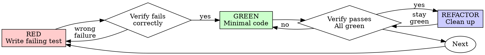

# Test-Driven Development (TDD) in Rust

## Overview

Write the test first. Watch it fail. Write minimal code to pass.

**Core principle:** If you didn't watch the test fail, you don't know if it tests the right thing.

**Violating the letter of the rules is violating the spirit of the rules.**

## When to Use

**Always:**
- New features
- Bug fixes
- Refactoring
- Behavior changes

**Exceptions (ask your human partner):**
- Throwaway prototypes
- Generated code (e.g., via `build.rs` or proc-macros)
- Configuration files (`Cargo.toml`, etc.)

Thinking "skip TDD just this once"? Stop. That's rationalization.

## The Iron Law

NO PRODUCTION CODE WITHOUT A FAILING TEST FIRST

Write code before the test? Delete it. Start over.

**No exceptions:**
- Don't keep it as "reference"
- Don't "adapt" it while writing tests
- Don't look at it
- Delete means delete

Implement fresh from tests. Period.

## Red-Green-Refactor



### RED - Write Failing Test

Write one minimal test showing what should happen.

<Good>
```rust
#[tokio::test]
async fn retries_failed_operations_three_times() {
    let attempts = std::sync::atomic::AtomicUsize::new(0);

    let operation = || async {
        let current = attempts.fetch_add(1, std::sync::atomic::Ordering::SeqCst) + 1;
        if current < 3 {
            Err("fail")
        } else {
            Ok("success")
        }
    };

    let result = retry_operation(operation).await;

    assert_eq!(result, Ok("success"));
    assert_eq!(attempts.load(std::sync::atomic::Ordering::SeqCst), 3);
}
```
Clear name, tests real behavior, single focus
</Good>

<Bad>
```rust
#[tokio::test]
async fn test_retry_works() {
    let mut mock = MockOperation::new();
    mock.expect_call()
        .times(3)
        .returning(|| Err("fail"));

    let _ = retry_operation(mock).await;
    // Vague name, testing mock calls instead of outcome/behavior
}
```
</Bad>

**Requirements:**
- One behavior
- Clear name
- Real code (no mocks unless unavoidable)

### Verify RED - Watch It Fail

**MANDATORY. Never skip.**

```bash
cargo test retries_failed_operations_three_times
```

Confirm:
- Test fails (assertion failure, not a compilation error if the function stub exists)
- Failure message is expected
- Fails because feature missing (not due to syntax typos or incorrect imports)

**Test passes?** You're testing existing behavior. Fix test.
**Test error or panic?** Add the minimum function signature returning a placeholder/todo (todo!()), then re-run until it fails assertion correctly.

### GREEN - Minimal Code

Write simplest code to pass the test.

<Good>
```rust
pub async fn retry_operation<F, Fut, T, E>(mut op: F) -> Result<T, E>
where
    F: FnMut() -> Fut,
    Fut: std::future::Future<Output = Result<T, E>>,
{
    let mut last_err = None;
    for i in 0..3 {
        match op().await {
            Ok(val) => return Ok(val),
            Err(err) => {
                if i == 2 {
                    return Err(err);
                }
                last_err = Some(err);
            }
        }
    }
    Err(last_err.expect("unreachable"))
}
```
Just enough to pass
</Good>

<Bad>
```rust
pub enum BackoffStrategy {
    Linear,
    Exponential,
}

pub struct RetryOptions<F> {
    pub max_retries: Option<usize>,
    pub backoff: Option<BackoffStrategy>,
    pub on_retry: Option<F>,
}

pub async fn retry_operation<Op, Fut, T, E, OnRetry>(
    _op: Op,
    _options: Option<RetryOptions<OnRetry>>,
) -> Result<T, E>
where
    Op: FnMut() -> Fut,
    Fut: std::future::Future<Output = Result<T, E>>,
    OnRetry: FnMut(usize),
{
    // YAGNI - Over-engineered before tests demand it
    todo!()
}
```
Over-engineered
</Bad>

Don't add features, refactor other code, or "improve" beyond the test.

### Verify GREEN - Watch It Pass

**MANDATORY.**

```bash
$ cargo test rejects_empty_email
...
test rejects_empty_email ... ok
```

Confirm:
- Test passes
- Other tests still pass
- Output pristine (no errors, warnings)

**Test fails?** Fix code, not test.

**Other tests fail?** Fix now.

### REFACTOR - Clean Up

After green only:
- Remove code duplication
- Improve names and module structure
- Extract helper functions or traits
- Run cargo clippy and clean warnings

Keep tests green. Don't add behavior.

### Repeat

Next failing test for next feature.

## Good Tests

| Quality | Good | Bad |
|---------|------|-----|
| **Minimal** | One thing. "and" in name? Split it. | `fn validates_email_and_domain_and_whitespace()` |
| **Clear** | Name describes behavior | `fn test_1()` |
| **Shows intent** | Demonstrates clear Rust API usage & Result matching | Obscures what the API expects or returns |

When writing or changing any test, read [writing-good-tests.md](writing-good-tests.md) for the rules that keep tests honest:
- Name the production change that would make the test fail — before writing it
- Assert on real behavior, never on mock behavior
- Keep test-only code inside #[cfg(test)] or tests/common/, out of production structs
- Understand a dependency's side effects before mocking it

## Common Rationalizations

| Excuse | Reality |
|--------|---------|
| "Too simple to test" | Simple code breaks. Test takes 30 seconds. |
| "I'll test after" | Tests written after pass immediately — which proves nothing. They may test the wrong thing, test the implementation instead of the behavior, or miss the edge case you forgot. You never watched it fail, so you never proved it can catch the bug. Test-first forces that failure. |
| "Tests after achieve same goals (spirit not ritual)" | Tests-after answer "what does this do?"; tests-first answer "what should this do?" Tests written after are biased by the code you already wrote — you verify the cases you remembered, not the ones you'd have discovered. Coverage without proof the tests work. |
| "Already manually tested" | Manual testing is ad-hoc: no record of what you covered, no way to re-run it when the code changes, easy to forget cases under pressure. "Worked when I tried it" ≠ comprehensive. Automated tests run the same way every time. |
| "Deleting X hours is wasteful" | Sunk cost fallacy — that time is already spent either way. The real choice: rewrite with TDD (high confidence) vs. keep it and bolt tests on after (low confidence, likely bugs). Keeping code you can't trust is the waste. |
| "Keep as reference, write tests first" | You'll adapt it. That's testing after. Delete means delete. |
| "Need to explore first" | Fine. Throw away exploration, start with TDD. |
| "Test hard = design unclear" | Listen to test. Hard to test = hard to use. |
| "TDD will slow me down" | TDD IS the pragmatic path: catches bugs before commit, prevents regressions, lets you refactor without fear. "Pragmatic" shortcuts mean debugging in production — slower, not faster. |
| "Manual test faster" | Manual doesn't prove edge cases. You'll re-test every change. |
| "Existing code has no tests" | You're improving it. Add tests for existing code. |

## Red Flags - STOP and Start Over

- Code before test
- Test after implementation
- Test passes immediately
- Can't explain why test failed
- Tests added "later"
- Rationalizing "just this once"
- "I already manually tested it"
- "Tests after achieve the same purpose"
- "It's about spirit not ritual"
- "Keep as reference" or "adapt existing code"
- "Already spent X hours, deleting is wasteful"
- "TDD is dogmatic, I'm being pragmatic"
- "This is different because..."

**All of these mean: Delete code. Start over with TDD.**

## Example: Bug Fix

**Bug:** Empty email accepted

**RED**
```rust
#[test]
fn rejects_empty_email() {
    let result = validate_form(&FormInput { email: "".to_string() });
    assert_eq!(result, Err(ValidationError::EmailRequired));
}
```

**Verify RED**
```rust
$ cargo test rejects_empty_email
...
failures:
    rejects_empty_email: expected Err(EmailRequired), got Ok(())
```

**GREEN**
```rust
pub fn validate_form(input: &FormInput) -> Result<(), ValidationError> {
    if input.email.trim().is_empty() {
        return Err(ValidationError::EmailRequired);
    }
    Ok(())
}
```

**Verify GREEN**
```rust
$ cargo test rejects_empty_email
...
test rejects_empty_email ... ok
```

**REFACTOR**
Extract validation for multiple fields if needed.

## Verification Checklist

Before marking work complete:

- [ ] Every new function/method has a test
- [ ] Watched each test fail before implementing
- [ ] Each test failed for expected reason (feature missing, not typo)
- [ ] Wrote minimal code to pass each test
- [ ] All tests pass
- [ ] Output pristine (no errors, no warnings)
- [ ] Tests use real code (mocks only if unavoidable)
- [ ] Edge cases and errors covered

Can't check all boxes? You skipped TDD. Start over.

## When Stuck

| Problem | Solution |
|---------|----------|
| Don't know how to test | Write wished-for API. Write assertion first. Ask your human partner. |
| Test too complicated | Design too complicated. Simplify interface. |
| Must mock everything | Code too coupled. Use generics or trait objects (dyn Trait) for dependency injection. |
| Test setup huge | Extract helpers. Move shared builders or fixtures to #[cfg(test)] mod helpers. If setup is still large, simplify design. |

## Debugging Integration

Bug found? Write failing test reproducing it. Follow TDD cycle. Test proves fix and prevents regression.

Never fix bugs without a test.

## Final Rule

```
Production code → test exists and failed first
Otherwise → not TDD
```

No exceptions without your human partner's permission.
